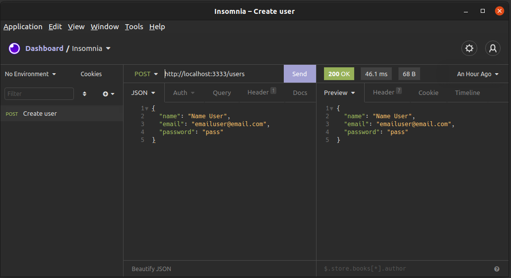

# Tarefas em background utilizando NodeJs Bull e Redis

 

Diante de uma situação de cadastro de usuário, no qual ele recebe um e-mail ao ser cadastrado, uma tarefa de envio de e-mail será executada em segundo plano e em outro servidor para que este usuário não fique esperando até que a tarefa seja concluída.
A implementação foi feita visando a escalabilidade, pois está preparada para receber mais tarefas em background.
Foi usado a biblioteca Bull para fazer a criação e gerenciamento da fila.

## Features

* cadastro de usuários;
* envio de email para o usuário cadastrado;
* tratamento de falhas de envio de e-mail;

## Bibliotecas e recursos utilizados

* yarn;
* express;
* nodemon;
* sucrase;
* nodemailer;
* dotenv;
* bull;
* redis;
* npm-run-all;
* mailtrap.io;

## Requisitos

* Ter NodeJs instalado na seu sistema;
* Ter o Docker instalado na seu sistema;
* Ter o Insomnia instalado ou outro cliente consumidor de API de seu gosto;
* Inserir as suas variáveis de ambiente do mailtrap.io; (*Você pode encontra-las ao se cadastrar em https://mailtrap.io*)
* Inserir variáveis de ambiente do redis;
* Criar e executar o container docker do REDIS com o comando: `docker run --name redis -p 6379:6379 -d -t redis:alpine`

## Testando com Insomnia

* Instale as dependências com `yarn install`
* Rode o servidor com `yarn dev`.
* Crie uma nova requisição do tipo post no formado JSON de envio dados.
* Envie os dados para http://localhost:3333/users. Você terá o mesmo objeto como retorno.
* Verifique seu maiotrap.

*Baseado no [neste video](https://www.youtube.com/watch?v=uonKHztGhko) da Rocketseat*
